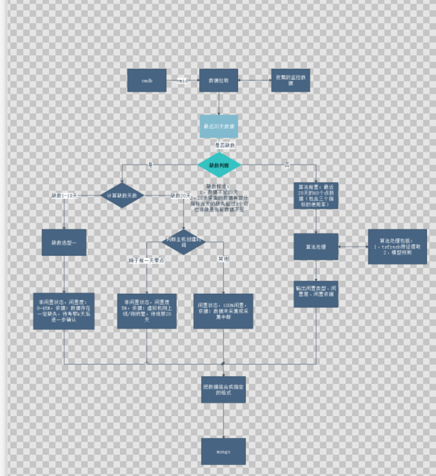

# 测试分析之原理分析个人浅谈

## **当前的现状：**

需求是产品的蓝图，那么产品的实现原理就是蓝图的现实化，让蓝天变成可以触手可及的事物。

我们在使用产品的过程中经常遇到这样的情况，需求定义了造飞机，结果实际上造出来了一辆同比例大小的飞机模型。看起来交互满足了需求，前端实现了效果，但是真正用起产品却是各种异常报错，功能不支持等等。

测试在这个环节中，按照需求的蓝图去验证了飞机模型的外表结构，却忽视了内在的需求，我们需要的不是不能飞起的飞机模型（UI），而是需要可以在蓝天中风雨无阻，自由飞翔的飞机（真正的产品）。

## **分析期望的目标：**

1、理解原理分析的流程

2、原理分析的要点

3、原理分析和需求的结合
## **原理分析的流程：**

1、先了解功能的流程图，所负责模块的功能实现从用户触发的入口到最终反馈给用户，中间经历类哪些模块。

2、理解各个模块在这个功能实现中负责的核心内容，cmdb提供了对象vmid（就是要做被预测的主机对象），监控模块负责提供监控数据，核心算法模块提供对监控数据的处理，mongo负责存储数据和读取数据。

3、分析模块间的相互联动关系，例如这个cmdb提供了主角的对象后，监控模块会用这些对象去mongo里面查看现有的监控数据，找出该对象20天的数据，然后给算法提供前置依据，算法按照依据得出结论后把数据返回作为主机的一部分信息存储起来。

4、分析新增的进程是单进程还是多进程，这个地方会影响到处理的效率，例如我们这边新增处理算法的进程处理单个任务的时间差不多1s，如果处理数量少还好，要是处理4000多任务，要是不多开几个进程，以单进程处理就得消耗1哥多小时，要是任务量达到了万台级别时间更夸张。当然这里的进程数量上限也要考虑到对平台和其他模块的资源占用是否有影响，取个平衡。

5、考虑服务通信端口对外和对内是否有新增，是否影响现有的端口或者是引入安全问题之类的。例如主备优化的新增功能，支持在nat网络下搭建scp主备。考虑到原有的scp主备需要的4个端口，sdk4430端口，ssh22345端口，命令操作7000端口，数据库通信3306端口。这些都是主备功能需要用到的基本端口，如果支持nat部署，意味着需要把网络暴露到公网上，传输都要经过各种路由器，交换机，传输到mysql还是明文传输，这时候就要考虑如何把提升端口的安全性，同时保障主备功能正常。

6、考虑实现的函数方法是同步还是异步处理，这个在处理一些耗时长的任务，尤其需要考虑。

7、考虑资源的状态转换，例如主机的状态，在不同状态时候的约束

8、考虑是否要做定时任务，例如登录后定时的退出，每天凌晨定时的虚拟机闲置度预测，还有操作任务1小时定时清理，刷新的自动更新时间等等，我们需要考虑自己的模块是否有这些需要。

9、网络部署模式：请求在不同网络的经过过程，可能会遇到的问题，例如内外网传输的白名单、防火墙限制，传输到国外的限制，不同前后端域名可能会出现的跨域问题等等

## **原理分析的要点：**

上个部分的分析是帮助我们理解开发的实现，下面部分说的是我们测试需要验证的要点，和设计相关比较紧密关联。

1、分析模块的入参，哪些是必填哪些是选填的。例如闲置度验收的参数需要20天的cpu、内存、磁盘的数据，这几个就是关键参数。是测试设计需要验证的。

2、分析权限校验机制，例如portal-api里面会校验是否角色权限是否充足，传参格式是否正确，还有我们产品的功能操作很多都是依赖序列号，序列号的校验也是关键。

这里整理下就是数据权限（角色、参数等）和功能权限（序列号、角色等）的检验。

3、分析异常处理逻辑，假如一切没有按照功能实现的去执行，在某个环节出现了异常，异常的处理机制是什么，如何去处理？是否可靠，稳定？例如闲置度的预测假如数据不足20天这么处理，假如参数校验不通过怎么样，假如进程挂了怎么办？假如其他模块罢工了怎么办，假如资源占用不释放怎么办？

## **原理分析和需求的结合：**

前面的原理分析看起来似乎可以没有问题，却也犯了脱离需求的错误。这是测试经常喜欢犯的两大错误，只考虑需求不考虑实现原理导致测出来的东西是是而非，只考虑实现原理不考虑需求导致产品不满足用户场景，没有真正的解决用户场景。

那么如何把原理结合需求去考虑呢：

1、了解用户部署的场景：

用户用的网络类型，规模量：不同的网络部署方式会影响数据的传输方式，公网和私网的数据流传输安全性、速度，对网络的可靠性要求都不一样。

2、了解业务的依赖：

我们所要测试的对象，业务上依赖哪些模块，影响哪些模块，这里就是测试的交互分析，依赖的上流资源数据是否会有被抢占的可能性，资源的校验检查，资源的释放流程。

3、按照用户的使用地图去走一遍流程：

用户怎么使用这个产品，使用的过程中对应的原理上怎么样的？从数据权限上看是否有问题？因为很多时候，独立的看原理貌似可以走的通，但是结合实际的业务就会发现有坑。

## 测试分析梳理xmind例子

[测试分析地图模板.xmind](https://www.yuque.com/attachments/yuque/0/2023/xmind/38605698/1703488138635-867dd066-8b62-4e1f-bbd7-89b6029c42f9.xmind?_lake_card=%7B%22src%22%3A%22https%3A%2F%2Fwww.yuque.com%2Fattachments%2Fyuque%2F0%2F2023%2Fxmind%2F38605698%2F1703488138635-867dd066-8b62-4e1f-bbd7-89b6029c42f9.xmind%22%2C%22name%22%3A%22%E6%B5%8B%E8%AF%95%E5%88%86%E6%9E%90%E5%9C%B0%E5%9B%BE%E6%A8%A1%E6%9D%BF.xmind%22%2C%22size%22%3A84056%2C%22ext%22%3A%22xmind%22%2C%22source%22%3A%22%22%2C%22status%22%3A%22done%22%2C%22download%22%3Atrue%2C%22taskId%22%3A%22uee434b55-b8a8-4d07-b8ba-c9dd7195dce%22%2C%22taskType%22%3A%22upload%22%2C%22type%22%3A%22%22%2C%22__spacing%22%3A%22both%22%2C%22mode%22%3A%22title%22%2C%22id%22%3A%22b4NBd%22%2C%22margin%22%3A%7B%22top%22%3Atrue%2C%22bottom%22%3Atrue%7D%2C%22card%22%3A%22file%22%7D)

